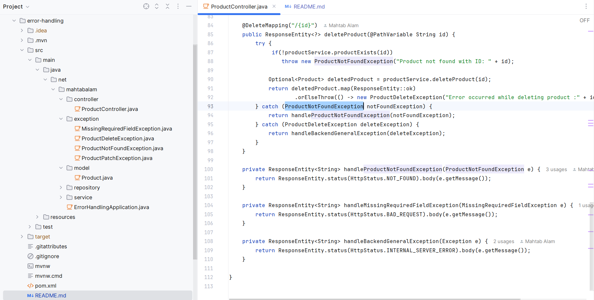

# Error Handling in Spring

## Project Structure



## How to handle error/exceptions

One very simple way to handle exception is to surround the code which can result in error/exception with try-catch, and then handle the thrown exception.


## ProductController

In the ProductController below, we added methods to handle error scenarios 

1. When product with given id is not found in GET/DELETE/PATCH operation
2. When in POST call the required name field is not sent by client
3. When any error occurs while deleting or patching a product 

**Note that we are throwing application specific exceptions, e.g. ProductNotFoundException, MissingRequiredFieldException, ProductPatchException and ProductDeleteException.**

```java
@RestController
@RequestMapping("/api/v1/products")
public class ProductController {

    private final ProductService productService;

    public ProductController(ProductService productService) {
        this.productService = productService;
    }

    @PostMapping
    public ResponseEntity<?> addProduct(@Valid @RequestBody Product product, BindingResult bindingResult) {
        try{
            if (bindingResult.hasErrors()) {
                for (FieldError error : bindingResult.getFieldErrors()) {
                    if (error.getCode().equals("NotNull")) {
                        throw new MissingRequiredFieldException(error.getDefaultMessage());
                    }
                }
            }
            Product savedProduct = productService.addProduct(product);
            return ResponseEntity.status(HttpStatus.CREATED).body(savedProduct);
        }catch(MissingRequiredFieldException exp){
            return handleMissingRequiredFieldException(exp);
        }
    }

    @GetMapping("/{id}")
    public ResponseEntity<?> getProductById(@PathVariable String id) {
        try {
            Optional<Product> product = productService.getProductById(id);
            return product.map(ResponseEntity::ok)
                    .orElseThrow(() -> new ProductNotFoundException("Product not found with ID: " + id));
        } catch (ProductNotFoundException e) {
            return handleProductNotFoundException(e);
        }
    }

    @GetMapping
    public ResponseEntity<List<Product>> getAllProducts() {
        return ResponseEntity.ok(productService.getAllProducts());
    }

    @PutMapping("/{id}")
    public ResponseEntity<Product> replaceOrAddProduct(@PathVariable String id, @RequestBody Product product) {
        return ResponseEntity.ok(productService.replaceOrAddProduct(id, product));
    }

    @PatchMapping("/{id}")
    public ResponseEntity<?> patchProduct(@PathVariable String id, @RequestBody Map<String, Object> updates) {
        try {
            if(!productService.productExists(id))
              throw new ProductNotFoundException("Product not found with ID: " + id);

            Optional<Product> updatedProduct = productService.patchProduct(id, updates);
            return updatedProduct.map(ResponseEntity::ok)
                    .orElseThrow(() -> new ProductPatchException("Error occurred while updating product :" + id));
        } catch(ProductNotFoundException notFoundException) {
            return handleProductNotFoundException(notFoundException);
        } catch(ProductPatchException patchException) {
            return handleBackendGeneralException(patchException);
        }
    }

    @DeleteMapping("/{id}")
    public ResponseEntity<?> deleteProduct(@PathVariable String id) {
        try {
             if(!productService.productExists(id))
                throw new ProductNotFoundException("Product not found with ID: " + id);

            Optional<Product> deletedProduct = productService.deleteProduct(id);
            return deletedProduct.map(ResponseEntity::ok)
                    .orElseThrow(() -> new ProductDeleteException("Error occurred while deleting product :" + id));
        } catch (ProductNotFoundException notFoundException) {
            return handleProductNotFoundException(notFoundException);
        } catch (ProductDeleteException deleteException) {
            return handleBackendGeneralException(deleteException);
        }
    }

    private ResponseEntity<String> handleProductNotFoundException(ProductNotFoundException e) {
        return ResponseEntity.status(HttpStatus.NOT_FOUND).body(e.getMessage());
    }

    private ResponseEntity<String> handleMissingRequiredFieldException(MissingRequiredFieldException e) {
        return ResponseEntity.status(HttpStatus.BAD_REQUEST).body(e.getMessage());
    }

    private ResponseEntity<String> handleBackendGeneralException(Exception e) {
        return ResponseEntity.status(HttpStatus.INTERNAL_SERVER_ERROR).body(e.getMessage());
    }

}
```
