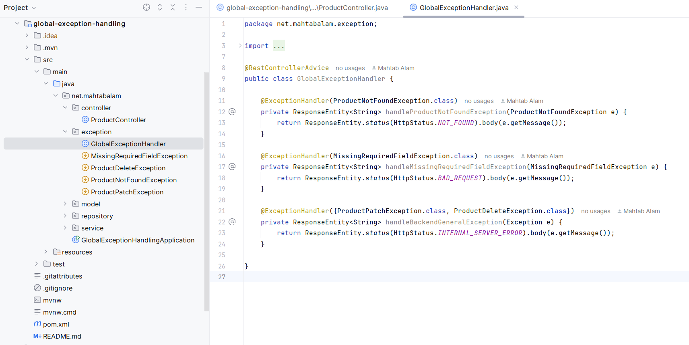

# Global Exception Handling using @RestControllerAdvice

A controller advice allows you to use exactly the same exception handling techniques but apply them across the whole application, not just to an individual controller. 

Any class annotated with @RestControllerAdvice becomes a controller-advice and there we can add Exception handling methods annotated with @ExceptionHandler.

## Project Structure

