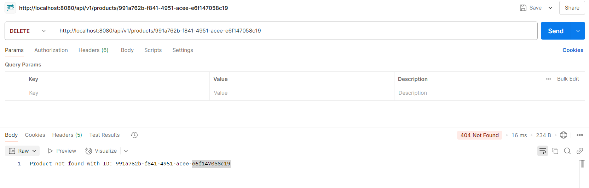

# Global Exception Handling using @RestControllerAdvice

A controller advice allows you to use exactly the same exception handling techniques but apply them across the whole application, not just to an individual controller. 

Any class annotated with @RestControllerAdvice becomes a controller-advice and there we can add Exception handling methods annotated with @ExceptionHandler.

## Project Structure


## Error Handling

### GET - Product with given id not found


### POST - Required field, name missing in the request body


### DELETE - Product with given id not found



## GlobalExceptionHandler

```java
@RestControllerAdvice
public class GlobalExceptionHandler {

    @ExceptionHandler(ProductNotFoundException.class)
    private ResponseEntity<String> handleProductNotFoundException(ProductNotFoundException e) {
        return ResponseEntity.status(HttpStatus.NOT_FOUND).body(e.getMessage());
    }

    @ExceptionHandler(MissingRequiredFieldException.class)
    private ResponseEntity<String> handleMissingRequiredFieldException(MissingRequiredFieldException e) {
        return ResponseEntity.status(HttpStatus.BAD_REQUEST).body(e.getMessage());
    }

    @ExceptionHandler({ProductPatchException.class, ProductDeleteException.class})
    private ResponseEntity<String> handleBackendGeneralException(Exception e) {
        return ResponseEntity.status(HttpStatus.INTERNAL_SERVER_ERROR).body(e.getMessage());
    }

}
```

## ProductController

**The ProductController looks much cleaner, as we have moved Exception handlers to GlobalExceptionHandler class which is annotated with @RestControllerAdvice.**

**👉 Note that we can still have specific exception handlers in the ProdcutController for exceptions which are not handled by GlobalExceptionHandler.**

```java
@RestController
@RequestMapping("/api/v1/products")
public class ProductController {

    private final ProductService productService;

    public ProductController(ProductService productService) {
        this.productService = productService;
    }

    @PostMapping
    public ResponseEntity<?> addProduct(@Valid @RequestBody Product product, BindingResult bindingResult) {
        if (bindingResult.hasErrors()) {
            for (FieldError error : bindingResult.getFieldErrors()) {
                if (error.getCode().equals("NotNull")) {
                    throw new MissingRequiredFieldException(error.getDefaultMessage());
                }
            }
        }
        Product savedProduct = productService.addProduct(product);
        return ResponseEntity.status(HttpStatus.CREATED).body(savedProduct);
    }

    @GetMapping("/{id}")
    public ResponseEntity<?> getProductById(@PathVariable String id) {
        Optional<Product> product = productService.getProductById(id);
        return product.map(ResponseEntity::ok)
                    .orElseThrow(() -> new ProductNotFoundException("Product not found with ID: " + id));
    }

    @GetMapping
    public ResponseEntity<List<Product>> getAllProducts() {
        return ResponseEntity.ok(productService.getAllProducts());
    }

    @PutMapping("/{id}")
    public ResponseEntity<Product> replaceOrAddProduct(@PathVariable String id, @RequestBody Product product) {
        return ResponseEntity.ok(productService.replaceOrAddProduct(id, product));
    }

    @PatchMapping("/{id}")
    public ResponseEntity<?> patchProduct(@PathVariable String id, @RequestBody Map<String, Object> updates) {
        if(!productService.productExists(id))
            throw new ProductNotFoundException("Product not found with ID: " + id);

        Optional<Product> updatedProduct = productService.patchProduct(id, updates);

        return updatedProduct.map(ResponseEntity::ok)
                    .orElseThrow(() -> new ProductPatchException("Error occurred while updating product :" + id));
    }

    @DeleteMapping("/{id}")
    public ResponseEntity<?> deleteProduct(@PathVariable String id) {
        if(!productService.productExists(id))
            throw new ProductNotFoundException("Product not found with ID: " + id);

        Optional<Product> deletedProduct = productService.deleteProduct(id);

        return deletedProduct.map(ResponseEntity::ok)
                    .orElseThrow(() -> new ProductDeleteException("Error occurred while deleting product :" + id));
    }
}
```
